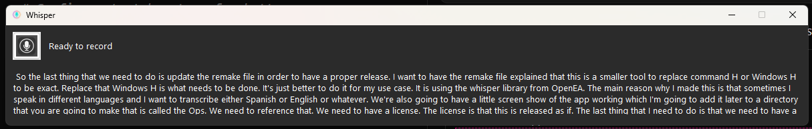

1# Whisper CLI

A lightweight alternative to Windows H (Windows Speech Recognition) that provides more flexibility and language support using OpenAI's Whisper model.

## Overview

This tool is designed to replace the built-in Windows H speech recognition feature, offering enhanced capabilities for multilingual speech-to-text transcription. It's particularly useful for users who need to transcribe speech in multiple languages (English, Spanish, etc.) with high accuracy.

## Features

- 🎤 Simple one-click recording interface
- 🌍 Multi-language support (English, Spanish, and more)
- 📝 Real-time transcription
- 🎯 High accuracy using OpenAI's Whisper model
- 🖥️ Clean, simple interface

## Demo

Here's a screenshot of the application interface:



## Installation

### Option 1: Download Pre-built Executable

1. Go to the [Releases](https://github.com/elpargo/whisper-windows-gui/releases) page
2. Download the latest version of `whisper-cli.exe`
3. Run the executable

### Option 2: Build from Source

1. Clone the repository:
   ```bash
   git clone https://github.com/elpargo/whisper-windows-gui/releases
   cd whisper-gui
   ```

2. Create and activate a virtual environment:
   ```bash
   python -m venv venv
   .\venv\Scripts\activate
   ```

3. Install dependencies:
   ```bash
   pip install -r requirements.txt
   ```

4. Build the executable:
   ```bash
   .\build.ps1
   ```

## Usage

1. Run the application
2. Click the microphone button (or press Space/Enter) to start recording
3. Speak in your desired language
4. Click the button again (or press Space/Enter) to stop recording
5. The transcription will appear in the text area
6. Click "Save" to save the transcription to a file

Note: You can use either the Space or Enter key interchangeably to start/stop recording.

## Why Whisper CLI?

While Windows H provides basic speech recognition, it has limitations:
- Limited language support
- Requires internet connection
- Less accurate for non-English languages
- No easy way to save transcriptions

Whisper CLI addresses these issues by:
- Supporting multiple languages
- Working offline
- Providing higher accuracy
- Offering easy transcription saving

## Technical Details

- Built with Python and PyQt6
- Uses OpenAI's Whisper model for transcription
- Compiled with PyInstaller for easy distribution

## License

This project is released under the MIT License. See the [LICENSE](LICENSE) file for details.

## Contributing

Contributions are welcome! Please feel free to submit a Pull Request.

## Acknowledgments

- [OpenAI Whisper](https://github.com/openai/whisper) for the speech recognition model
- [PyQt6](https://www.riverbankcomputing.com/software/pyqt/) for the GUI framework 

## TODOs
- 💾 Save transcriptions to text files
- Invoke on global OS keybinding (ie: replace windows + H entirely)
- output to text input field directly (Also a windows + H feature)